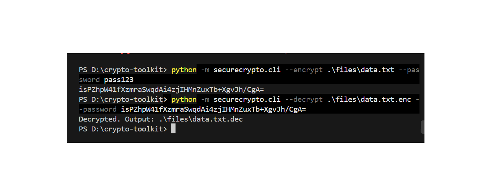
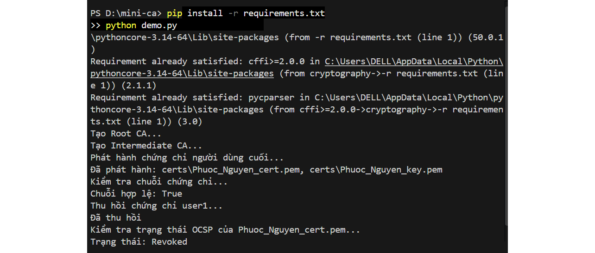
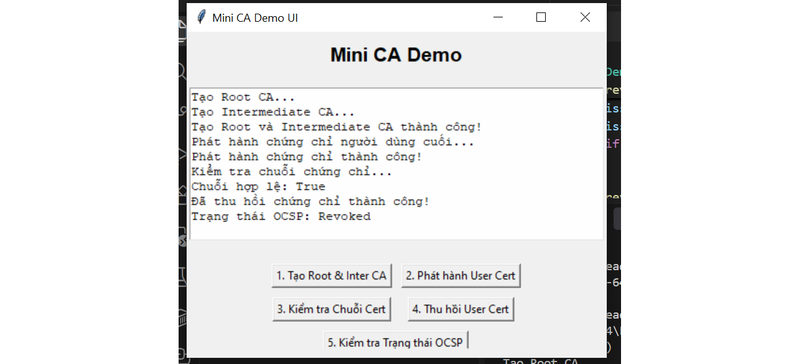

# BÁO CÁO ĐỒ ÁN / BÀI LAB: CRYPTO-TOOLKIT & MINI-CA PKI SYSTEM

* **Họ và tên sinh viên:** Nguyễn Trần Minh Việt
* **Mã số sinh viên:** 2387700075
* **Lớp:** 23DATA1
* **Chuyên ngành:** An ninh Mạng (Cybersecurity)
* **Trường:** Đại học Công nghệ TP.HCM (HUTECH)

---

## 📌 TỔNG QUAN ĐỒ ÁN
Đồ án này tập trung hiện thực hóa các giải thuật mật mã học cốt lõi và xây dựng hệ thống quản lý hạ tầng khóa công khai (PKI). Dự án được chia thành 2 phần chính:
1. **Crypto-Toolkit:** Thư viện bảo mật dữ liệu bao gồm mã hóa đối xứng (AES), hàm dẫn xuất khóa (PBKDF2/Argon2), chữ ký số (RSA) và giao diện dòng lệnh (CLI).
2. **Mini-CA System:** Hệ thống cấp phát, quản lý và kiểm tra chuỗi chứng chỉ số phân cấp (Root CA -> Intermediate CA -> End-Entity Certificate) kèm theo tính năng thu hồi và kiểm tra trạng thái qua OCSP/CRL.

---

## 🛠️ PHẦN 1: CRYPTO-TOOLKIT (HIỆN THỰC THƯ VIỆN MÃ HÓA)

### 1. Cách làm và giải thích thuật toán
Trong phần này, tôi sử dụng thư viện `cryptography` để xây dựng các module xử lý bảo mật với các nguyên lý kỹ thuật sau:
* **Mã hóa file đối xứng (AES):** Sử dụng thuật toán AES kết hợp với chế độ an toàn để mã hóa toàn bộ dữ liệu tệp tin đầu vào nhằm đảm bảo tính bảo mật tuyệt đối (Confidentiality).
* **Dẫn xuất khóa (Key Derivation - PBKDF2):** Chuyển đổi mật khẩu văn bản thô (ví dụ: `pass123`) do người dùng nhập vào thành khóa mã hóa có độ dài chuẩn (Base64) thông qua việc kết hợp với chuỗi muối ngẫu nhiên (Salt) và thuật toán băm `SHA256`.
* **Kiểm thử (Unit Testing):** Xây dựng các test cases bằng `pytest` để kiểm tra độ chính xác của các hàm AES, băm mật khẩu và ký số RSA.

### 2. Minh chứng thực thi CLI
Sau khi cấu hình và cài đặt gói thư viện ở chế độ editable (`pip install -e .`), tôi tiến hành thực thi lệnh mã hóa tệp dữ liệu `data.txt` và giải mã ngược lại thành công trên Terminal[cite: 1, 4]:



* **Lệnh mã hóa:** `python -m securecrypto.cli --encrypt .\files\data.txt --password pass123` -> Sinh khóa và mã hóa tệp tin, trả về chuỗi Base64 bảo mật.
* **Lệnh giải mã:** `python -m securecrypto.cli --decrypt .\files\data.txt.enc --password <chuoi_base64>` -> Phục hồi chính xác tệp gốc tại `.\files\data.txt.dec`.

---

## 🔐 PHẦN 2: HỆ THỐNG QUẢN LÝ CHỨNG CHỈ SỐ (MINI-CA)

### 1. Cách làm và mô hình phân cấp PKI
Hệ thống Mini-CA được xây dựng theo mô hình phân cấp tin cậy (Hierarchical PKI) nhằm mô phỏng quy trình hoạt động của cơ quan chứng thực số thực tế:
* **Khởi tạo Root CA:** Tạo cặp khóa RSA riêng tư/công khai cho chứng chỉ gốc, lập chứng chỉ tự ký (`Self-signed`) với định danh là CA cấp cao nhất.
* **Khởi tạo Intermediate CA:** Tạo cặp khóa cho CA trung gian và được **ký số xác thực bởi khóa bí mật của Root CA**, giúp bảo vệ Root CA khỏi các rủi ro lộ khóa.
* **Phát hành chứng chỉ người dùng (End-Entity Certificate):** Intermediate CA tiến hành cấp phát chứng chỉ số cho người dùng (`Phuoc_Nguyen_cert.pem`) kèm theo các thông tin định danh chủ thể.
* **Kiểm tra chuỗi chứng chỉ (Certificate Chain Validation):** Viết logic code duyệt ngược chuỗi tin cậy từ User -> Intermediate -> Root để xác thực chữ ký số và tính hợp lệ.
* **Thu hồi chứng chỉ & Kiểm tra OCSP:** Mô phỏng cơ chế đánh dấu thu hồi chứng chỉ (Revocation) và sử dụng module kiểm tra trạng thái thời gian thực, trả về trạng thái chính xác `Revoked`.

### 2. Minh chứng qua Dòng lệnh (Terminal Script)
Chạy kịch bản tự động `demo.py` để thực thi toàn bộ các bước từ khởi tạo, cấp phát đến thu hồi chứng chỉ:



* **Chi tiết kết quả thực thi[cite: 2]:**
  * Tự động cài đặt các gói phụ thuộc và khởi tạo thành công Root CA, Intermediate CA[cite: 2].
  * Phát hành thành công chứng chỉ người dùng (`Fhuoc_Nguyen_cert.pem`, `Phuoc_Nguyen_key.pem`)[cite: 2].
  * Kiểm tra chuỗi chứng chỉ trả về kết quả hợp lệ: `Chuỗi hợp lệ: True`[cite: 2].
  * Thực hiện thu hồi chứng chỉ thành công và kiểm tra trạng thái OCSP trả về đúng trạng thái bị hủy: `Trạng thái: Revoked`[cite: 2].

### 3. Minh chứng qua Giao diện Đồ họa (GUI Demo UI)
Để nâng cao tính trực quan, hệ thống tích hợp giao diện người dùng sử dụng thư viện `Tkinter`, cho phép thao tác toàn bộ các tiến trình PKI chỉ với các nút bấm[cite: 3]:



* **Các chức năng tương tác trên giao diện[cite: 3]:**
  1. *Nút 1:* Tạo Root & Intermediate CA[cite: 3].
  2. *Nút 2:* Phát hành User Certificate[cite: 3].
  3. *Nút 3:* Kiểm tra chuỗi chứng chỉ (Certificate Chain)[cite: 3].
  4. *Nút 4:* Thu hồi User Certificate[cite: 3].
  5. *Nút 5:* Kiểm tra trạng thái OCSP[cite: 3].

---

## 🚀 HƯỚNG DẪN CÀI ĐẶT VÀ CHẠY CHƯƠNG TRÌNH

1. **Cài đặt thư viện phụ thuộc:**
   ```bash
   pip install -r requirements.txt
   pip install -e .