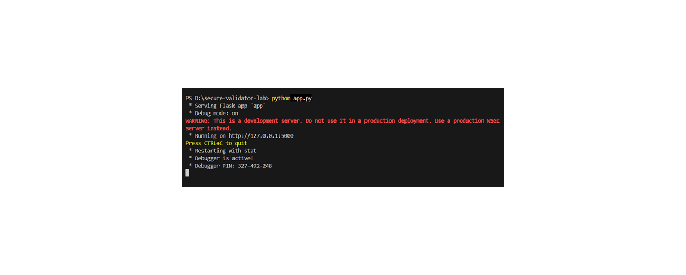
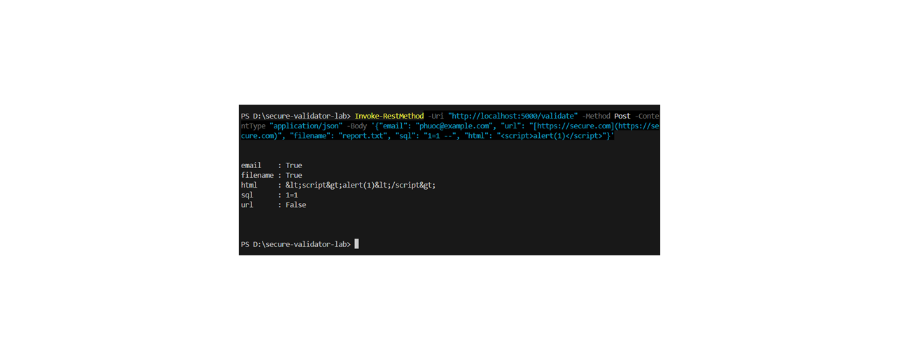
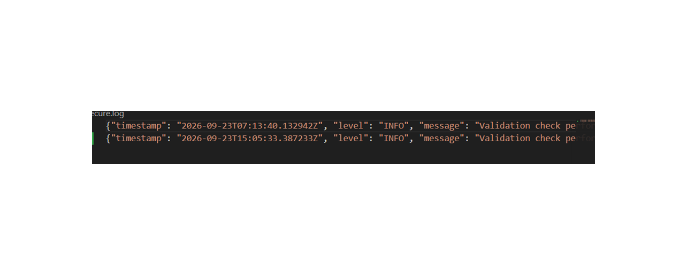
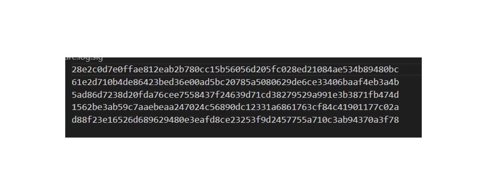

# Bài 1: Cơ sở lập trình bảo mật và kiểm tra đầu vào (Secure Input Validation & Secure Logger)

Dự án thực hành môn lập trình bảo mật tập trung vào các kỹ thuật phòng chống lỗ hổng ứng dụng web, bao gồm: kiểm tra và làm sạch dữ liệu đầu vào, ghi nhật ký ưu tiên bảo mật (Secure Logging), phát hiện chỉnh sửa log trái phép (Tamper Detection) và bảo mật mã nguồn qua Git Hooks.

---

## 📁 Cấu trúc dự án
```text
secure-validator-lab/
├── .githooks/
│   └── pre-commit         # Git hook quét thông tin nhạy cảm trước khi commit
├── securevalidator/
│   ├── __init__.py
│   └── core.py            # Các hàm validate email, url, filename và sanitize SQLi, XSS
├── securelogger/
│   ├── __init__.py
│   └── logger.py          # Hệ thống Secure Logger (JSON, PII Masking, Tamper Detection)
├── app.py                 # API Flask chính
├── requirements.txt       # Các thư viện phụ thuộc
└── README.md              # Tài liệu hướng dẫn dự án
# Báo cáo Bài lab: Bảo mật Đầu vào & Kiểm thử Lỗ hổng (Secure Input Validation)

## 1. Giải thích về các hình thức tấn công (Attack Explanation)
Trong dự án này, chúng ta tập trung phòng chống hai lỗ hổng phổ biến trong OWASP Top 10:
* **SQL Injection (SQLi):** Kẻ tấn công chèn các câu lệnh SQL độc hại (ví dụ: `1=1 --`) vào trường đầu vào để thao túng câu truy vấn cơ sở dữ liệu gốc, nhằm vượt qua xác thực hoặc trích xuất dữ liệu trái phép.
* **Cross-Site Scripting (XSS):** Kẻ tấn công tiêm các đoạn mã kịch bản độc hại (ví dụ: `<script>alert(1)</script>`) vào ứng dụng web. Khi trình duyệt của người khác render dữ liệu này mà không được mã hóa, mã độc sẽ thực thi trong phiên làm việc của nạn nhân.

## 2. How to bypass (Cách thực hiện tấn công/bypass)
Để kiểm thử khả năng chống chịu của hệ thống trước và sau khi áp dụng bộ lọc (Validator), các hướng tấn công giả lập thường được thực hiện qua Postman:
* **Bypass SQLi:** Gửi payload chứa các toán tử logic luôn đúng kèm ký tự chú thích (ví dụ: `sql: "OR 1=1 --"` hoặc `"1' OR '1'='1"`) nhằm vô hiệu hóa điều kiện kiểm tra dữ liệu.
* **Bypass XSS:** Gửi các payload mã hóa đa dạng (ví dụ: ``, hoặc mã hóa HTML/Hex entities) nhằm lách qua các bộ lọc lọc từ khóa đơn giản (`<script>`).

## 3. Tại sao bypass được? (Why it can be bypassed)
* **Nguyên nhân cốt lõi khi chưa có bảo vệ (Unvalidated/Unsanitized Input):** 
  - Ứng dụng tin tưởng tuyệt đối vào dữ liệu do người dùng gửi lên (`Untrusted Input`). 
  - Dữ liệu được nối thẳng vào câu lệnh SQL hoặc in trực tiếp ra HTML mà không qua bước chuẩn hóa (Sanitization) hay mã hóa (Encoding).
* **Cơ chế phòng thủ trong bài lab này:**
  - Đối với SQLi: Sử dụng hàm `sanitize_sql_input` để chủ động loại bỏ các ký tự nguy hiểm (`--`, `;`, các từ khóa nhạy cảm như `OR`, `SELECT`,...).
  - Đối với XSS: Sử dụng hàm `sanitize_html_input` (ứng dụng `html.escape`) để chuyển đổi các ký tự đặc biệt (`<`, `>`, `&`,...) thành các thực thể an toàn (`&lt;`, `&gt;`,...), khiến trình duyệt chỉ hiển thị dưới dạng văn bản thuần túy thay vì chạy đoạn mã đó.
  ## 4. Hình ảnh minh chứng kết quả (Screenshots)

### Minh chứng 1


### Minh chứng 2


### Minh chứng 3


### Minh chứng 4
